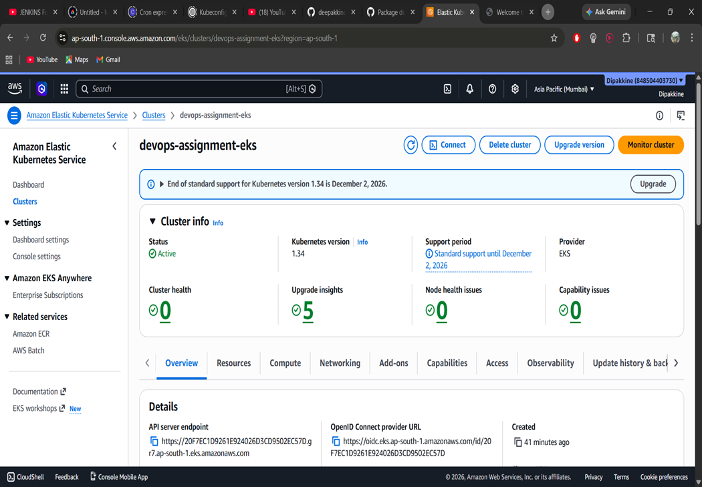
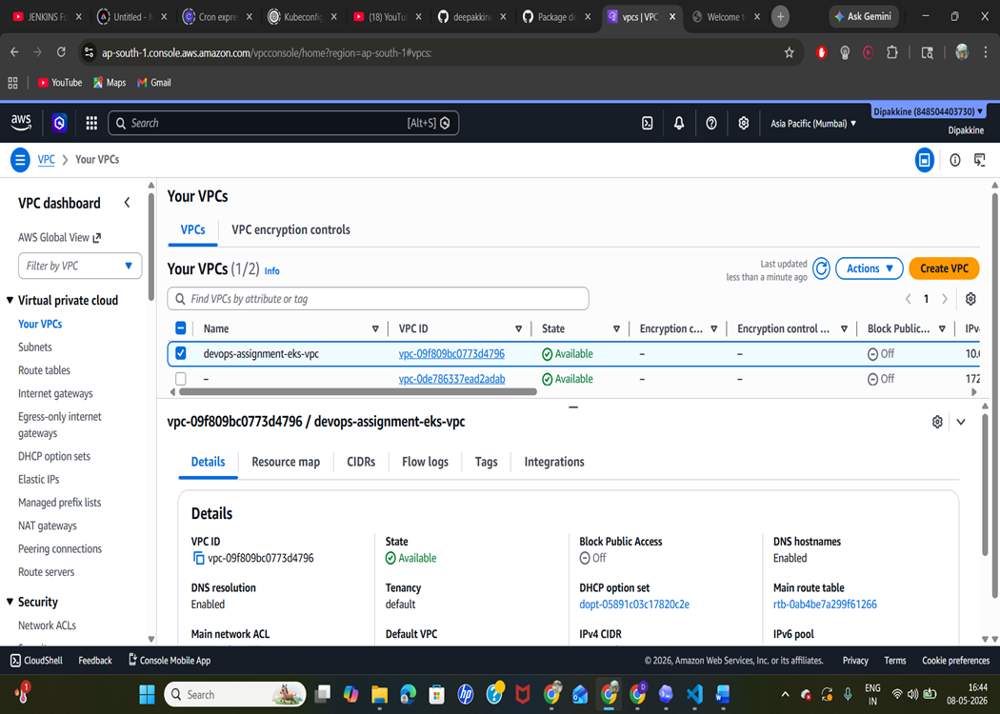
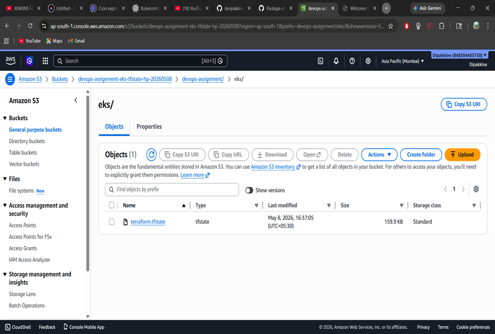
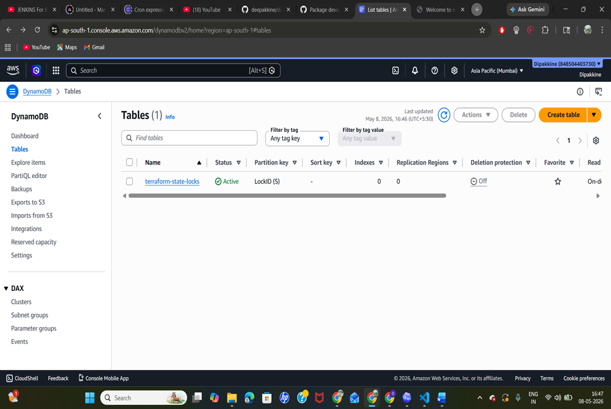
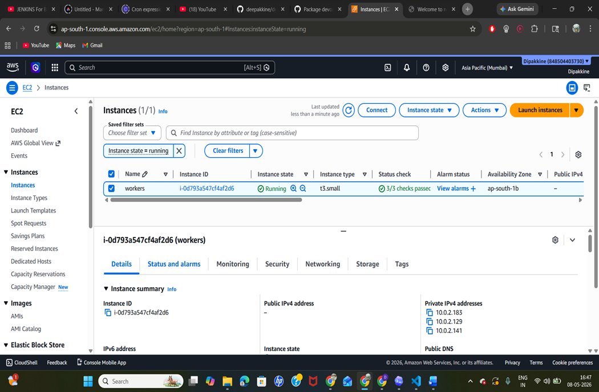
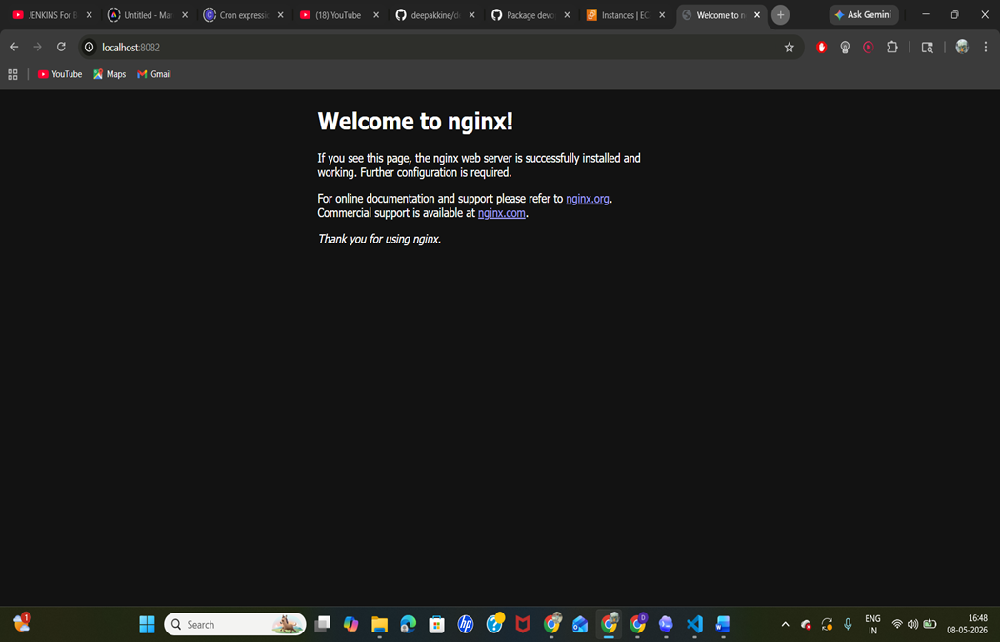
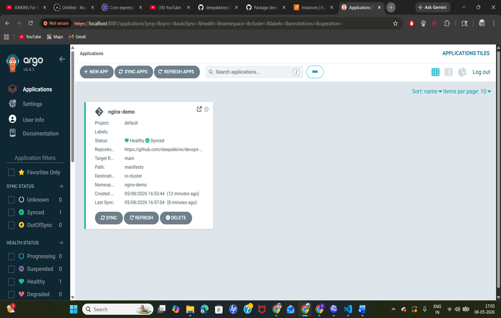
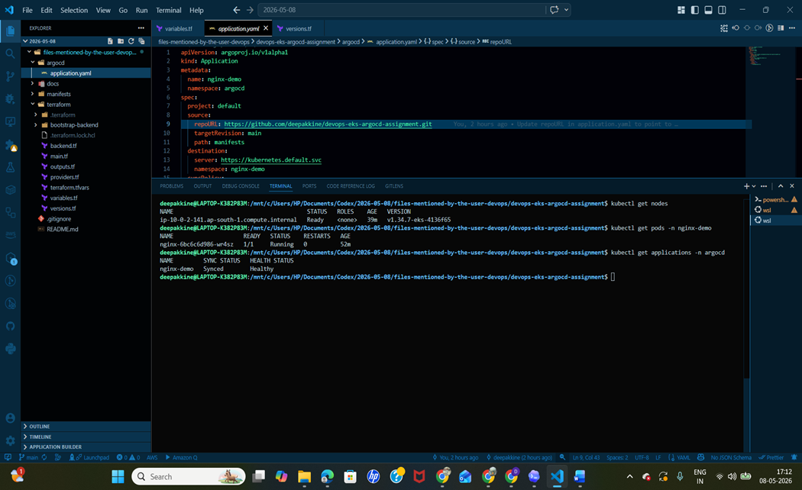

# DevOps Assignment: AWS EKS, Terraform, Kubernetes, and ArgoCD

This repository contains a complete AWS DevOps assignment solution. It provisions an EKS cluster using Terraform, stores Terraform state in S3 with DynamoDB locking, deploys an NGINX application with Kubernetes manifests, and manages the application through ArgoCD.

## Architecture

```text
GitHub Repository
        |
        v
Terraform
        |
        v
AWS VPC + EKS + Managed Node Group
        |
        v
ArgoCD
        |
        v
NGINX Kubernetes Application
```

## Repository Structure

```text
.
|-- terraform/
|   |-- backend.tf
|   |-- bootstrap-backend/
|   |   |-- main.tf
|   |   |-- outputs.tf
|   |   |-- providers.tf
|   |   |-- terraform.tfvars
|   |   |-- variables.tf
|   |   `-- versions.tf
|   |-- main.tf
|   |-- outputs.tf
|   |-- providers.tf
|   |-- terraform.tfvars
|   |-- variables.tf
|   `-- versions.tf
|-- manifests/
|   |-- namespace.yaml
|   |-- deployment.yaml
|   |-- service.yaml
|   |-- ingress.yaml
|   `-- kustomization.yaml
|-- argocd/
|   `-- application.yaml
|-- docs/
|   `-- submission-checklist.md
`-- README.md
```

## Prerequisites

- AWS account
- AWS CLI
- Terraform
- kubectl
- Git
- GitHub repository for this assignment

## Step 1: Configure AWS CLI

Configure your AWS credentials:

```bash
aws configure
```

Use:

```text
AWS Access Key ID: your-access-key
AWS Secret Access Key: your-secret-key
Default region name: ap-south-1
Default output format:
```

Verify AWS access:

```bash
aws sts get-caller-identity
```

## Step 2: Update ArgoCD Repository URL

Open `argocd/application.yaml` and update the GitHub repository URL:

```yaml
repoURL: https://github.com/deepakkine/devops-eks-argocd-assignment.git
```

Replace it with your actual repository URL.

## Step 3: Create Terraform Backend Resources

The main Terraform code uses remote state in S3 and state locking with DynamoDB.

Backend values are already defined in:

```text
terraform/bootstrap-backend/terraform.tfvars
```

Current backend values:

```hcl
aws_region                 = "ap-south-1"
state_bucket_name          = "devops-assignment-eks-tfstate-hp-20260508"
lock_table_name            = "terraform-state-locks"
create_dynamodb_lock_table = true
```

Create the S3 bucket and DynamoDB lock table:

```bash
cd terraform/bootstrap-backend
terraform init
terraform fmt
terraform validate
terraform plan
terraform apply # or use
terraform apply --auto-approve
```

This creates:

- S3 bucket for Terraform state
- S3 bucket versioning
- S3 server-side encryption
- S3 public access block
- DynamoDB table for state locking

## Step 4: Provision EKS Cluster

Return to the main Terraform folder:

```bash
cd ..
```

The backend is configured in:

```text
terraform/backend.tf
```

Current backend configuration:

```hcl
terraform {
  backend "s3" {
    bucket         = "devops-assignment-eks-tfstate-hp-20260508"
    key            = "devops-assignment/eks/terraform.tfstate"
    region         = "ap-south-1"
    encrypt        = true
    dynamodb_table = "terraform-state-locks"
  }
}
```

EKS input values are defined in:

```text
terraform/terraform.tfvars
```

Current EKS values:

```hcl
aws_region          = "ap-south-1"
cluster_name        = "devops-assignment-eks"
environment         = "assignment"
cluster_version     = "1.34"
node_instance_types = ["t3.small"]
node_min_size       = 1
node_desired_size   = 1
node_max_size       = 3
```

Initialize Terraform with the S3 backend:

```bash
terraform init
```

Format and validate:

```bash
terraform fmt
terraform validate
```

Preview resources:

```bash
terraform plan
```

Create the EKS infrastructure:

```bash
terraform apply
# or use
terraform apply --auto-approve
```

This provisions:

- VPC
- Public subnets
- Private subnets
- Internet Gateway
- NAT Gateway
- Route tables and route table associations
- EKS cluster
- EKS managed node group
- IAM roles required by EKS

## Step 5: Configure kubectl for EKS

After Terraform completes, connect `kubectl` to the EKS cluster:

```bash
aws eks update-kubeconfig --region ap-south-1 --name devops-assignment-eks
```

Verify cluster access:

```bash
kubectl get nodes
```

Expected result: EKS worker nodes should show `Ready`.

## Step 6: Deploy NGINX Manually

From the repository root:

```bash
kubectl apply -k manifests/
```

Verify resources:

```bash
kubectl get namespace nginx-demo
kubectl get pods -n nginx-demo
kubectl get svc -n nginx-demo
```

Access NGINX using port-forward:

```bash
kubectl port-forward svc/nginx -n nginx-demo 8082:80
```

Open in browser:

```text
http://localhost:8082
```

Expected result: the default NGINX welcome page should load.

## Step 7: Install ArgoCD

Create the ArgoCD namespace:

```bash
kubectl create namespace argocd
```

Install ArgoCD:

```bash
kubectl apply -n argocd -f https://raw.githubusercontent.com/argoproj/argo-cd/stable/manifests/install.yaml
```

Check ArgoCD pods:

```bash
kubectl get pods -n argocd
```

Wait until all ArgoCD pods are running.

## Step 8: Access ArgoCD UI

Expose ArgoCD locally:

```bash
kubectl port-forward svc/argocd-server -n argocd 8081:443
```

Open:

```text
https://localhost:8081
```

Get the initial admin password:

```bash
kubectl -n argocd get secret argocd-initial-admin-secret -o jsonpath="{.data.password}" | base64 -d
```

Login details:

```text
Username: admin
Password: output from the command above
```

## Step 9: Deploy NGINX Through ArgoCD

Apply the ArgoCD Application resource:

```bash
kubectl apply -f argocd/application.yaml
```

Check the ArgoCD application:

```bash
kubectl get applications -n argocd
```

Verify NGINX resources:

```bash
kubectl get all -n nginx-demo
```

ArgoCD should sync the NGINX manifests from GitHub and keep the application in the desired state.

If the cluster uses a very small worker node, keep optional ArgoCD components scaled down to avoid pod scheduling limits:

```bash
kubectl scale deployment argocd-dex-server -n argocd --replicas=0
kubectl scale deployment argocd-notifications-controller -n argocd --replicas=0
kubectl scale deployment argocd-applicationset-controller -n argocd --replicas=0
```

## Optional Bonus: Ingress and DNS

The repository includes a sample Ingress manifest:

```text
manifests/ingress.yaml
```

For AWS EKS, install an ingress controller such as:

- AWS Load Balancer Controller
- NGINX Ingress Controller

After installing an ingress controller, update the Ingress host:

```yaml
host: nginx.example.com
```

Then point your domain or subdomain to the generated load balancer DNS name using Route 53 or another DNS provider.

Validate DNS:

```bash
nslookup nginx.example.com
curl http://nginx.example.com
```

## Commands Used during Assignment

Terraform backend:

```bash
aws s3 ls s3://devops-assignment-eks-tfstate-hp-20260508
aws dynamodb describe-table --table-name terraform-state-locks --region ap-south-1
```

EKS:

```bash
kubectl get nodes
kubectl get namespaces
```

NGINX:

```bash
kubectl get pods -n nginx-demo
kubectl get svc -n nginx-demo
kubectl describe deployment nginx -n nginx-demo
```

ArgoCD:

```bash
kubectl get pods -n argocd
kubectl get applications -n argocd
```

## Cleanup

Delete the ArgoCD application:

```bash
kubectl delete -f argocd/application.yaml
```

Delete NGINX resources:

```bash
kubectl delete -k manifests/
```

Destroy the EKS infrastructure:

```bash
cd terraform
terraform destroy
```

After the main infrastructure is destroyed, destroy backend resources if they are no longer needed:

```bash
cd bootstrap-backend
terraform destroy
```

Before destroying backend resources, make sure you no longer need the stored Terraform state.

## Submission Evidence

Include screenshots or terminal output for:

- `terraform apply` completed successfully
- `kubectl get nodes`
- `kubectl get pods -n nginx-demo`
- NGINX page at `http://localhost:8082`
- ArgoCD UI at `https://localhost:8081`
- `kubectl get applications -n argocd`

## Project Screenshots / Evidence

- The following screenshots provide execution evidence for the AWS infrastructure, Terraform backend, Kubernetes deployment, NGINX access, and ArgoCD GitOps synchronization.

## Screenshot 1: AWS EKS cluster is active



## Screenshot 2: VPC created for the EKS cluster



## Screenshot 3: Terraform remote state stored in S3



## Screenshot 4: DynamoDB table created for Terraform state locking



## Screenshot 5: EKS worker node running on EC2



## Screenshot 6: NGINX application accessible through localhost port-forward



## Screenshot 7: ArgoCD application synced and healthy



## Screenshot 8: Terminal verification: EKS node, NGINX pod, and ArgoCD Application



 `Screenshots were captured from the AWS Console, browser access endpoints, and kubectl terminal output during assignment execution.`

## Cost Note

This assignment creates billable AWS resources, including the EKS control plane, NAT Gateway, S3, and EC2 worker nodes. The worker node type is set to `t3.small` because `t3.micro` has a very low EKS pod limit and may not schedule application pods after Kubernetes system pods are running. Run `terraform destroy` after completing the assignment to avoid ongoing charges.
